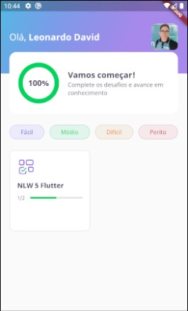
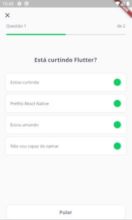
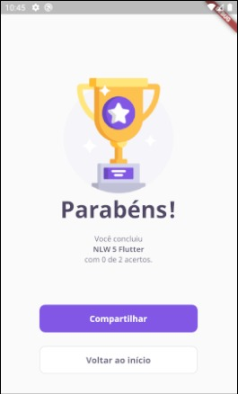
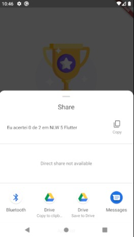

    
    

# dev_quiz

Aplicativo desenvolvido durante a 5ª edição da Next Level Week promovida pela Rocketseat.
O objetivo era fazer um quiz de perguntas sobre Flutter.

## Tecnologias utilizadas
- [Flutter](https://flutter.dev/)

## Screenshots do aplicativo

    <h3>Home Page</h3>
    
    <h3>Quiz Page</h3>
    
    <h3>Result Page</h3>
    
    <h3>Share Page</h3>
    

